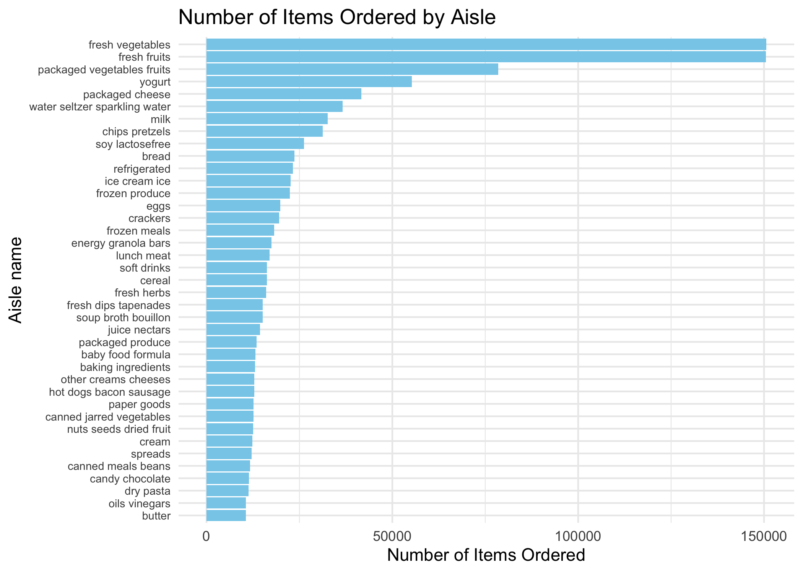

p8105_hw3_NL2836
================
Ngan Le
2023-10-12

Load the necessary libraries and datasets.

``` r
library(tidyverse)
library(p8105.datasets)
library(gt)
data("instacart")
```

# Problem 1

##### How many aisles are there, and which aisles are the most items ordered from?

Count the number of distinct aisles.

``` r
aisle_count = 
instacart %>% 
  summarize(n_distinct(aisle))
```

Arrange the `aisle` variable according to observation frequencies and
output the first (highest frequency) row.

``` r
aisle_most_order =
  instacart %>% 
  group_by(aisle) %>% 
  summarize(freq_order = n()) %>% 
  arrange(desc(freq_order)) %>% 
  pull(aisle) %>% 
  first()
```

Answer: There are 134 different aisles. The aisle from which most items
are ordered is fresh vegetables.

##### Make a plot that shows the number of items ordered in each aisle, limiting this to aisles with more than 10000 items ordered. Arrange aisles sensibly, and organize your plot so others can read it.

Filter aisles to those with more than 10000 and arrange.

``` r
aisle_plot =
  instacart %>% 
  group_by(aisle) %>% 
  summarize(freq_aisle= n()) %>%
  filter(freq_aisle > 10000)
```

Make a plot to show the number of items ordered in each aisle.

``` r
aisle_plot %>% 
  ggplot(aes(x= reorder(aisle, freq_aisle), y = freq_aisle)) + 
  geom_bar(stat = "identity", fill = "skyblue") + 
  coord_flip() +
  labs(x = "Aisle name", y = "Number of Items Ordered") +
  theme_minimal() +
  theme(axis.text.y = element_text(size = 7)) +
  ggtitle("Number of Items Ordered by Aisle")
```

<!-- -->

##### Make a table showing the three most popular items in each of the aisles “baking ingredients”, “dog food care”, and “packaged vegetables fruits”. Include the number of times each item is ordered in your table.

Get the 3 most popular items of each aisle.

``` r
popular_items =
  instacart %>% 
  select(aisle, product_name) %>% 
  filter(aisle == c("baking ingredients", "dog food care", "packaged vegetables fruits")) %>% 
  group_by(aisle, product_name) %>% 
  summarize(freq_pop=n(),.groups = 'drop') %>% 
  arrange(aisle, desc(freq_pop)) %>% 
  group_by(aisle)%>%
  top_n(3, wt = freq_pop)
```

Make a table.

``` r
popular_items %>%
  gt() %>%
  cols_label(
    aisle = "Aisle",
    product_name = "Product name",
    freq_pop = "Times ordered") %>% 
  tab_header(title = "Top 3 Popular Items by Aisle") %>%
  fmt_number(columns = vars(freq_pop), decimals = 0) 
```

<div id="ckgzijxthm" style="padding-left:0px;padding-right:0px;padding-top:10px;padding-bottom:10px;overflow-x:auto;overflow-y:auto;width:auto;height:auto;">
<style>#ckgzijxthm table {
  font-family: system-ui, 'Segoe UI', Roboto, Helvetica, Arial, sans-serif, 'Apple Color Emoji', 'Segoe UI Emoji', 'Segoe UI Symbol', 'Noto Color Emoji';
  -webkit-font-smoothing: antialiased;
  -moz-osx-font-smoothing: grayscale;
}
&#10;#ckgzijxthm thead, #ckgzijxthm tbody, #ckgzijxthm tfoot, #ckgzijxthm tr, #ckgzijxthm td, #ckgzijxthm th {
  border-style: none;
}
&#10;#ckgzijxthm p {
  margin: 0;
  padding: 0;
}
&#10;#ckgzijxthm .gt_table {
  display: table;
  border-collapse: collapse;
  line-height: normal;
  margin-left: auto;
  margin-right: auto;
  color: #333333;
  font-size: 16px;
  font-weight: normal;
  font-style: normal;
  background-color: #FFFFFF;
  width: auto;
  border-top-style: solid;
  border-top-width: 2px;
  border-top-color: #A8A8A8;
  border-right-style: none;
  border-right-width: 2px;
  border-right-color: #D3D3D3;
  border-bottom-style: solid;
  border-bottom-width: 2px;
  border-bottom-color: #A8A8A8;
  border-left-style: none;
  border-left-width: 2px;
  border-left-color: #D3D3D3;
}
&#10;#ckgzijxthm .gt_caption {
  padding-top: 4px;
  padding-bottom: 4px;
}
&#10;#ckgzijxthm .gt_title {
  color: #333333;
  font-size: 125%;
  font-weight: initial;
  padding-top: 4px;
  padding-bottom: 4px;
  padding-left: 5px;
  padding-right: 5px;
  border-bottom-color: #FFFFFF;
  border-bottom-width: 0;
}
&#10;#ckgzijxthm .gt_subtitle {
  color: #333333;
  font-size: 85%;
  font-weight: initial;
  padding-top: 3px;
  padding-bottom: 5px;
  padding-left: 5px;
  padding-right: 5px;
  border-top-color: #FFFFFF;
  border-top-width: 0;
}
&#10;#ckgzijxthm .gt_heading {
  background-color: #FFFFFF;
  text-align: center;
  border-bottom-color: #FFFFFF;
  border-left-style: none;
  border-left-width: 1px;
  border-left-color: #D3D3D3;
  border-right-style: none;
  border-right-width: 1px;
  border-right-color: #D3D3D3;
}
&#10;#ckgzijxthm .gt_bottom_border {
  border-bottom-style: solid;
  border-bottom-width: 2px;
  border-bottom-color: #D3D3D3;
}
&#10;#ckgzijxthm .gt_col_headings {
  border-top-style: solid;
  border-top-width: 2px;
  border-top-color: #D3D3D3;
  border-bottom-style: solid;
  border-bottom-width: 2px;
  border-bottom-color: #D3D3D3;
  border-left-style: none;
  border-left-width: 1px;
  border-left-color: #D3D3D3;
  border-right-style: none;
  border-right-width: 1px;
  border-right-color: #D3D3D3;
}
&#10;#ckgzijxthm .gt_col_heading {
  color: #333333;
  background-color: #FFFFFF;
  font-size: 100%;
  font-weight: normal;
  text-transform: inherit;
  border-left-style: none;
  border-left-width: 1px;
  border-left-color: #D3D3D3;
  border-right-style: none;
  border-right-width: 1px;
  border-right-color: #D3D3D3;
  vertical-align: bottom;
  padding-top: 5px;
  padding-bottom: 6px;
  padding-left: 5px;
  padding-right: 5px;
  overflow-x: hidden;
}
&#10;#ckgzijxthm .gt_column_spanner_outer {
  color: #333333;
  background-color: #FFFFFF;
  font-size: 100%;
  font-weight: normal;
  text-transform: inherit;
  padding-top: 0;
  padding-bottom: 0;
  padding-left: 4px;
  padding-right: 4px;
}
&#10;#ckgzijxthm .gt_column_spanner_outer:first-child {
  padding-left: 0;
}
&#10;#ckgzijxthm .gt_column_spanner_outer:last-child {
  padding-right: 0;
}
&#10;#ckgzijxthm .gt_column_spanner {
  border-bottom-style: solid;
  border-bottom-width: 2px;
  border-bottom-color: #D3D3D3;
  vertical-align: bottom;
  padding-top: 5px;
  padding-bottom: 5px;
  overflow-x: hidden;
  display: inline-block;
  width: 100%;
}
&#10;#ckgzijxthm .gt_spanner_row {
  border-bottom-style: hidden;
}
&#10;#ckgzijxthm .gt_group_heading {
  padding-top: 8px;
  padding-bottom: 8px;
  padding-left: 5px;
  padding-right: 5px;
  color: #333333;
  background-color: #FFFFFF;
  font-size: 100%;
  font-weight: initial;
  text-transform: inherit;
  border-top-style: solid;
  border-top-width: 2px;
  border-top-color: #D3D3D3;
  border-bottom-style: solid;
  border-bottom-width: 2px;
  border-bottom-color: #D3D3D3;
  border-left-style: none;
  border-left-width: 1px;
  border-left-color: #D3D3D3;
  border-right-style: none;
  border-right-width: 1px;
  border-right-color: #D3D3D3;
  vertical-align: middle;
  text-align: left;
}
&#10;#ckgzijxthm .gt_empty_group_heading {
  padding: 0.5px;
  color: #333333;
  background-color: #FFFFFF;
  font-size: 100%;
  font-weight: initial;
  border-top-style: solid;
  border-top-width: 2px;
  border-top-color: #D3D3D3;
  border-bottom-style: solid;
  border-bottom-width: 2px;
  border-bottom-color: #D3D3D3;
  vertical-align: middle;
}
&#10;#ckgzijxthm .gt_from_md > :first-child {
  margin-top: 0;
}
&#10;#ckgzijxthm .gt_from_md > :last-child {
  margin-bottom: 0;
}
&#10;#ckgzijxthm .gt_row {
  padding-top: 8px;
  padding-bottom: 8px;
  padding-left: 5px;
  padding-right: 5px;
  margin: 10px;
  border-top-style: solid;
  border-top-width: 1px;
  border-top-color: #D3D3D3;
  border-left-style: none;
  border-left-width: 1px;
  border-left-color: #D3D3D3;
  border-right-style: none;
  border-right-width: 1px;
  border-right-color: #D3D3D3;
  vertical-align: middle;
  overflow-x: hidden;
}
&#10;#ckgzijxthm .gt_stub {
  color: #333333;
  background-color: #FFFFFF;
  font-size: 100%;
  font-weight: initial;
  text-transform: inherit;
  border-right-style: solid;
  border-right-width: 2px;
  border-right-color: #D3D3D3;
  padding-left: 5px;
  padding-right: 5px;
}
&#10;#ckgzijxthm .gt_stub_row_group {
  color: #333333;
  background-color: #FFFFFF;
  font-size: 100%;
  font-weight: initial;
  text-transform: inherit;
  border-right-style: solid;
  border-right-width: 2px;
  border-right-color: #D3D3D3;
  padding-left: 5px;
  padding-right: 5px;
  vertical-align: top;
}
&#10;#ckgzijxthm .gt_row_group_first td {
  border-top-width: 2px;
}
&#10;#ckgzijxthm .gt_row_group_first th {
  border-top-width: 2px;
}
&#10;#ckgzijxthm .gt_summary_row {
  color: #333333;
  background-color: #FFFFFF;
  text-transform: inherit;
  padding-top: 8px;
  padding-bottom: 8px;
  padding-left: 5px;
  padding-right: 5px;
}
&#10;#ckgzijxthm .gt_first_summary_row {
  border-top-style: solid;
  border-top-color: #D3D3D3;
}
&#10;#ckgzijxthm .gt_first_summary_row.thick {
  border-top-width: 2px;
}
&#10;#ckgzijxthm .gt_last_summary_row {
  padding-top: 8px;
  padding-bottom: 8px;
  padding-left: 5px;
  padding-right: 5px;
  border-bottom-style: solid;
  border-bottom-width: 2px;
  border-bottom-color: #D3D3D3;
}
&#10;#ckgzijxthm .gt_grand_summary_row {
  color: #333333;
  background-color: #FFFFFF;
  text-transform: inherit;
  padding-top: 8px;
  padding-bottom: 8px;
  padding-left: 5px;
  padding-right: 5px;
}
&#10;#ckgzijxthm .gt_first_grand_summary_row {
  padding-top: 8px;
  padding-bottom: 8px;
  padding-left: 5px;
  padding-right: 5px;
  border-top-style: double;
  border-top-width: 6px;
  border-top-color: #D3D3D3;
}
&#10;#ckgzijxthm .gt_last_grand_summary_row_top {
  padding-top: 8px;
  padding-bottom: 8px;
  padding-left: 5px;
  padding-right: 5px;
  border-bottom-style: double;
  border-bottom-width: 6px;
  border-bottom-color: #D3D3D3;
}
&#10;#ckgzijxthm .gt_striped {
  background-color: rgba(128, 128, 128, 0.05);
}
&#10;#ckgzijxthm .gt_table_body {
  border-top-style: solid;
  border-top-width: 2px;
  border-top-color: #D3D3D3;
  border-bottom-style: solid;
  border-bottom-width: 2px;
  border-bottom-color: #D3D3D3;
}
&#10;#ckgzijxthm .gt_footnotes {
  color: #333333;
  background-color: #FFFFFF;
  border-bottom-style: none;
  border-bottom-width: 2px;
  border-bottom-color: #D3D3D3;
  border-left-style: none;
  border-left-width: 2px;
  border-left-color: #D3D3D3;
  border-right-style: none;
  border-right-width: 2px;
  border-right-color: #D3D3D3;
}
&#10;#ckgzijxthm .gt_footnote {
  margin: 0px;
  font-size: 90%;
  padding-top: 4px;
  padding-bottom: 4px;
  padding-left: 5px;
  padding-right: 5px;
}
&#10;#ckgzijxthm .gt_sourcenotes {
  color: #333333;
  background-color: #FFFFFF;
  border-bottom-style: none;
  border-bottom-width: 2px;
  border-bottom-color: #D3D3D3;
  border-left-style: none;
  border-left-width: 2px;
  border-left-color: #D3D3D3;
  border-right-style: none;
  border-right-width: 2px;
  border-right-color: #D3D3D3;
}
&#10;#ckgzijxthm .gt_sourcenote {
  font-size: 90%;
  padding-top: 4px;
  padding-bottom: 4px;
  padding-left: 5px;
  padding-right: 5px;
}
&#10;#ckgzijxthm .gt_left {
  text-align: left;
}
&#10;#ckgzijxthm .gt_center {
  text-align: center;
}
&#10;#ckgzijxthm .gt_right {
  text-align: right;
  font-variant-numeric: tabular-nums;
}
&#10;#ckgzijxthm .gt_font_normal {
  font-weight: normal;
}
&#10;#ckgzijxthm .gt_font_bold {
  font-weight: bold;
}
&#10;#ckgzijxthm .gt_font_italic {
  font-style: italic;
}
&#10;#ckgzijxthm .gt_super {
  font-size: 65%;
}
&#10;#ckgzijxthm .gt_footnote_marks {
  font-size: 75%;
  vertical-align: 0.4em;
  position: initial;
}
&#10;#ckgzijxthm .gt_asterisk {
  font-size: 100%;
  vertical-align: 0;
}
&#10;#ckgzijxthm .gt_indent_1 {
  text-indent: 5px;
}
&#10;#ckgzijxthm .gt_indent_2 {
  text-indent: 10px;
}
&#10;#ckgzijxthm .gt_indent_3 {
  text-indent: 15px;
}
&#10;#ckgzijxthm .gt_indent_4 {
  text-indent: 20px;
}
&#10;#ckgzijxthm .gt_indent_5 {
  text-indent: 25px;
}
</style>
<table class="gt_table" data-quarto-disable-processing="false" data-quarto-bootstrap="false">
  <thead>
    <tr class="gt_heading">
      <td colspan="2" class="gt_heading gt_title gt_font_normal gt_bottom_border" style>Top 3 Popular Items by Aisle</td>
    </tr>
    &#10;    <tr class="gt_col_headings">
      <th class="gt_col_heading gt_columns_bottom_border gt_left" rowspan="1" colspan="1" scope="col" id="Product name">Product name</th>
      <th class="gt_col_heading gt_columns_bottom_border gt_right" rowspan="1" colspan="1" scope="col" id="Times ordered">Times ordered</th>
    </tr>
  </thead>
  <tbody class="gt_table_body">
    <tr class="gt_group_heading_row">
      <th colspan="2" class="gt_group_heading" scope="colgroup" id="baking ingredients">baking ingredients</th>
    </tr>
    <tr class="gt_row_group_first"><td headers="baking ingredients  product_name" class="gt_row gt_left">Light Brown Sugar</td>
<td headers="baking ingredients  freq_pop" class="gt_row gt_right">157</td></tr>
    <tr><td headers="baking ingredients  product_name" class="gt_row gt_left">Pure Baking Soda</td>
<td headers="baking ingredients  freq_pop" class="gt_row gt_right">140</td></tr>
    <tr><td headers="baking ingredients  product_name" class="gt_row gt_left">Organic Vanilla Extract</td>
<td headers="baking ingredients  freq_pop" class="gt_row gt_right">122</td></tr>
    <tr class="gt_group_heading_row">
      <th colspan="2" class="gt_group_heading" scope="colgroup" id="dog food care">dog food care</th>
    </tr>
    <tr class="gt_row_group_first"><td headers="dog food care  product_name" class="gt_row gt_left">Organix Grain Free Chicken &amp; Vegetable Dog Food</td>
<td headers="dog food care  freq_pop" class="gt_row gt_right">14</td></tr>
    <tr><td headers="dog food care  product_name" class="gt_row gt_left">Organix Chicken &amp; Brown Rice Recipe</td>
<td headers="dog food care  freq_pop" class="gt_row gt_right">13</td></tr>
    <tr><td headers="dog food care  product_name" class="gt_row gt_left">Original Dry Dog</td>
<td headers="dog food care  freq_pop" class="gt_row gt_right">9</td></tr>
    <tr class="gt_group_heading_row">
      <th colspan="2" class="gt_group_heading" scope="colgroup" id="packaged vegetables fruits">packaged vegetables fruits</th>
    </tr>
    <tr class="gt_row_group_first"><td headers="packaged vegetables fruits  product_name" class="gt_row gt_left">Organic Baby Spinach</td>
<td headers="packaged vegetables fruits  freq_pop" class="gt_row gt_right">3,324</td></tr>
    <tr><td headers="packaged vegetables fruits  product_name" class="gt_row gt_left">Organic Raspberries</td>
<td headers="packaged vegetables fruits  freq_pop" class="gt_row gt_right">1,920</td></tr>
    <tr><td headers="packaged vegetables fruits  product_name" class="gt_row gt_left">Organic Blueberries</td>
<td headers="packaged vegetables fruits  freq_pop" class="gt_row gt_right">1,692</td></tr>
  </tbody>
  &#10;  
</table>
</div>
