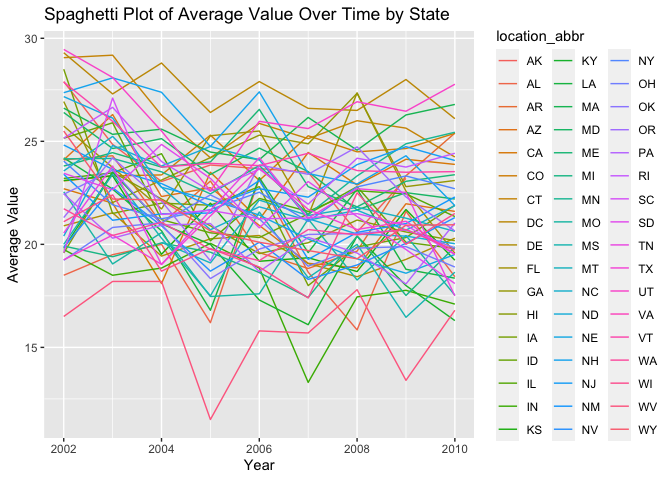
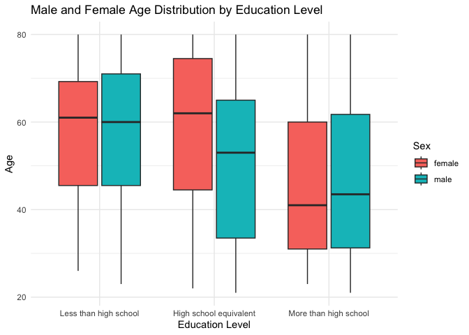
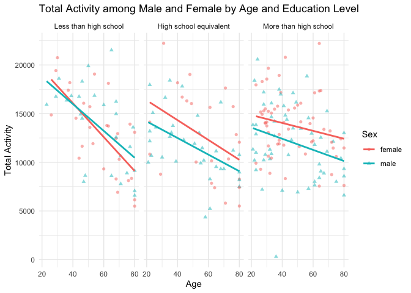
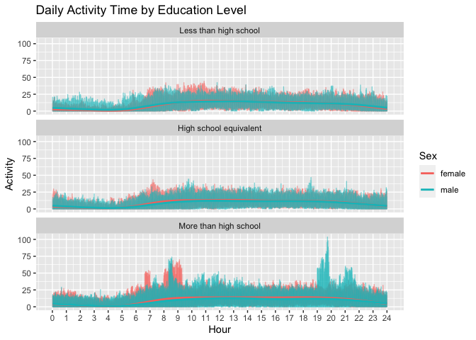

p8105_hw3_NL2836
================
Ngan Le
2023-10-12

Load the necessary libraries and datasets.

``` r
library(tidyverse)
library(p8105.datasets)
library(gt)
library(patchwork)
data("instacart")
data("brfss_smart2010")
```

# Problem 1

##### How many aisles are there, and which aisles are the most items ordered from?

Count the number of distinct aisles.

``` r
aisle_count = 
instacart %>% 
  summarize(n_distinct(aisle))
```

Arrange the `aisle` variable according to observation frequencies and
output the first (highest frequency) row.

``` r
aisle_most_order =
  instacart %>% 
  group_by(aisle) %>% 
  summarize(freq_order = n()) %>% 
  arrange(desc(freq_order)) %>% 
  pull(aisle) %>% 
  first()
```

Answer: There are 134 different aisles. The aisle from which most items
are ordered is fresh vegetables.

##### Make a plot that shows the number of items ordered in each aisle, limiting this to aisles with more than 10000 items ordered. Arrange aisles sensibly, and organize your plot so others can read it.

Filter aisles to those with more than 10000 and arrange.

``` r
aisle_plot =
  instacart %>% 
  group_by(aisle) %>% 
  summarize(freq_aisle= n()) %>%
  filter(freq_aisle > 10000)
```

Make a plot to show the number of items ordered in each aisle.

``` r
aisle_plot %>% 
  ggplot(aes(x= reorder(aisle, freq_aisle), y = freq_aisle)) + 
  geom_bar(stat = "identity", fill = "skyblue") + 
  coord_flip() +
  labs(x = "Aisle name", y = "Number of Items Ordered") +
  theme_minimal() +
  theme(axis.text.y = element_text(size = 7)) +
  ggtitle("Number of Items Ordered by Aisle")
```

<!-- -->

##### Make a table showing the three most popular items in each of the aisles “baking ingredients”, “dog food care”, and “packaged vegetables fruits”. Include the number of times each item is ordered in your table.

Get the 3 most popular items of each aisle.

``` r
popular_items =
  instacart %>% 
  filter(aisle %in% c("baking ingredients", "dog food care", "packaged vegetables fruits")) %>% 
  group_by(aisle, product_name) %>% 
  summarize(freq_pop=n(),.groups = 'drop') %>% 
  arrange(aisle, desc(freq_pop)) %>% 
  group_by(aisle)%>%
  top_n(3, wt = freq_pop)
```

Make a table.

``` r
knitr::kable(popular_items,caption = "Top 3 Popular Items by Aisle")
```

| aisle                      | product_name                                  | freq_pop |
|:---------------------------|:----------------------------------------------|---------:|
| baking ingredients         | Light Brown Sugar                             |      499 |
| baking ingredients         | Pure Baking Soda                              |      387 |
| baking ingredients         | Cane Sugar                                    |      336 |
| dog food care              | Snack Sticks Chicken & Rice Recipe Dog Treats |       30 |
| dog food care              | Organix Chicken & Brown Rice Recipe           |       28 |
| dog food care              | Small Dog Biscuits                            |       26 |
| packaged vegetables fruits | Organic Baby Spinach                          |     9784 |
| packaged vegetables fruits | Organic Raspberries                           |     5546 |
| packaged vegetables fruits | Organic Blueberries                           |     4966 |

Top 3 Popular Items by Aisle

##### Make a table showing the mean hour of the day at which Pink Lady Apples and Coffee Ice Cream are ordered on each day of the week; format this table for human readers (i.e. produce a 2 x 7 table).

``` r
time_order =
  instacart %>% 
  filter(product_name %in% c("Pink Lady Apples", "Coffee Ice Cream")) %>%
  group_by(product_name, order_dow) %>% 
  summarize(mean_hour = round(mean(order_hour_of_day, na.rm = TRUE),2), .groups = 'drop') %>% 
 pivot_wider(
    names_from = order_dow,
    values_from = mean_hour) %>% 
 rename(
   Monday = "0", 
   Tuesday = "1", 
   Wednesday = "2", 
   Thursday = "3", 
   Friday = "4", 
   Saturday = "5", 
   Sunday = "6"
       )
```

``` r
knitr::kable(time_order, caption = "Mean time order by week date", digits = 2)
```

| product_name     | Monday | Tuesday | Wednesday | Thursday | Friday | Saturday | Sunday |
|:-----------------|-------:|--------:|----------:|---------:|-------:|---------:|-------:|
| Coffee Ice Cream |  13.77 |   14.32 |     15.38 |    15.32 |  15.22 |    12.26 |  13.83 |
| Pink Lady Apples |  13.44 |   11.36 |     11.70 |    14.25 |  11.55 |    12.78 |  11.94 |

Mean time order by week date

# Problem 2

##### Data cleaning

``` r
p2_clean = 
  brfss_smart2010 %>%  
  janitor::clean_names() %>% 
  rename(
    location_abbr = locationabbr,
    location_desc = locationdesc,
    resp_id = respid,
        ) %>% 
  filter(
    topic == "Overall Health",
    response %in% c("Excellent", "Very good", "Good", "Fair", "Poor")
         ) %>% 
    mutate(response = factor(response, levels = c("Poor", "Fair", "Good", "Very good", "Excellent"), ordered = TRUE))
```

##### In 2002, which states were observed at 7 or more locations? What about in 2010?

``` r
df2002 =
p2_clean %>% 
  filter(year == "2002") %>% 
  group_by(location_abbr) %>% 
  summarize(dist_2002 = n_distinct(location_desc)) %>% 
  filter(dist_2002 >= 7) %>% 
  pull(location_abbr)
```

In 2002, the states that were observed at 7 or more locations are CT,
FL, MA, NC, NJ, PA.

``` r
df2010 =
p2_clean %>% 
  filter(year == "2010") %>% 
  group_by(location_abbr) %>% 
  summarize(dist_2010 = n_distinct(location_desc)) %>% 
  filter(dist_2010 >= 7) %>% 
  pull(location_abbr)
```

In 2010, the states that were observed at 7 or more locations are CA,
CO, FL, MA, MD, NC, NE, NJ, NY, OH, PA, SC, TX, WA.

##### Construct a dataset that is limited to Excellent responses, and contains, year, state, and a variable that averages the data_value across locations within a state. Make a “spaghetti” plot of this average value over time within a state (that is, make a plot showing a line for each state across years – the geom_line geometry and group aesthetic will help).

Make the dataframe.

``` r
excellent =
  p2_clean %>% 
  filter(response == "Excellent") %>% 
  select(year, location_abbr, data_value) %>% 
  group_by(year, location_abbr) %>% 
  summarize(mean_value = round(mean(data_value, na.rm = TRUE), 2),.groups = 'drop')
```

Plot the average value.

``` r
ggplot(excellent, aes(x = year, y = mean_value, group = location_abbr, color = location_abbr)) +
  geom_line() +
  labs(
    x = "Year",
    y = "Average Value",
    title = "Spaghetti Plot of Average Value Over Time by State"
  )
```

<!-- -->

The plot shows the trend of the average data value of each states from
2002 to 2010.WV average data value fluctuates more than others’, but
overall stay the lowest across the states over the year. DC average data
value overall stay the highest acrros the states over the year.

##### Make a two-panel plot showing, for the years 2006, and 2010, distribution of data_value for responses (“Poor” to “Excellent”) among locations in NY State.

``` r
plot_2006 = 
  p2_clean %>% 
  filter(location_abbr=="NY",year==2006)|>
  ggplot(aes(x =location_desc , y = data_value,fill=response)) + 
  geom_bar(position="dodge",stat="identity") +  
  labs(title = "Average data value by responses in New York State (2006)") + 
  theme(plot.title = element_text(size = 10), axis.text.x = element_text(angle = 20, hjust = 1),legend.position = "none")

 plot_2010 =
  p2_clean %>%  
  filter(location_abbr == "NY", year == "2010") %>% 
  ggplot(aes(x = location_desc, y = data_value, fill = response)) +
  geom_bar(position = "dodge", stat = "identity") +
  labs(title = " Average data value by responses in New York State (2010)") +
  theme(plot.title = element_text(size = 10), axis.text.x = element_text(angle = 20, hjust = 1)) 

options(repr.plot.width = 10, repr.plot.height = 4)
 
 
plot_2006 + plot_2010
```

<!-- -->

The two-panel plot displays the data values in the years 2006 and 2010
across various locations in New York (NY). Notably, some counties, such
as the Bronx, does not have any data reported for the year 2006. “Very
good” and “Good” remain as the highest data values overall.

# Problem 3

``` r
accel <- read_csv("./nhanes_accel.csv") %>%
  janitor::clean_names() %>% 
  mutate(seqn = as.integer(seqn))
```

``` r
dem <- read_csv("./nhanes_covar.csv", skip = 4) %>%
  janitor::clean_names()%>%
  na.omit() %>%
  filter(age >= 21) %>%
  mutate(seqn = as.integer(seqn), sex=as.factor(sex), education = as.factor(education))
```

``` r
joined <- inner_join(accel, dem, by = "seqn") 

joined =
  joined %>%
  select(seqn, sex, age, bmi, education, everything()) %>% 
  mutate(
    sex = if_else(sex == "1", "male", "female"), 
    education = if_else(education == "1", "Less than high school", 
                if_else(education == "2", "High school equivalent", 
                if_else(education =="3", "More than high school", NA)))
        )
```

This merged dataset has 228 rows and 1445 columns, including each
participant’s `sex`, `age`, `bmi`, `education`, and their MIMS recorded
every minute throughout the day.

``` r
edu_sex = table(joined$sex, joined$education)

knitr::kable(edu_sex, caption = "Male and Female Count by Education Level")
```

|        | High school equivalent | Less than high school | More than high school |
|:-------|-----------------------:|----------------------:|----------------------:|
| female |                     23 |                    28 |                    59 |
| male   |                     35 |                    27 |                    56 |

Male and Female Count by Education Level

In general, there are a higher percentage of people who have the
education level of `More than high school`. The distribution of Male and
Female in each Education Level category are roughly the same, except for
`High school equivalent` where we observe a slightly higher percentage
of male compared to female.

``` r
ggplot(
  joined, 
  aes(x = factor(education, 
                 levels= c("Less than high school", 
                           "High school equivalent", 
                           "More than high school"), 
                 ordered = TRUE), 
      y = age, 
      fill = sex)) +
  geom_boxplot() +
  labs(title = "Male and Female Age Distribution by Education Level",
       x = "Education Level",
       y = "Age",
       fill = "Sex") +
    theme_minimal()
```

<!-- -->

Among male, the average age tend to decreases among people who completed
higher level of education. Among female, people whose education level is
“Less than high school” and “High school equivalent” are roughly the
same, but we observe a significant decrease in the average age among
female whose education level is “More than high school”.

``` r
joined %>%
  mutate(rowsums = select(., -c(1:5)) %>% 
           rowSums(na.rm = TRUE))%>%
  ggplot(aes(x = age, y = rowsums, color = sex)) +
  geom_point(aes(shape = sex), alpha = 0.5) + 
  geom_smooth(method = "lm", se = FALSE) + 
  facet_wrap(~ factor(education, levels= c("Less than high school", 
                                           "High school equivalent", 
                                           "More than high school"), 
                      ordered = TRUE)) + 
  labs(title = "Total Activity among Male and Female by Age and Education Level",
       x = "Age",
       y = "Total Activity",
       color = "Sex",
       shape = "Sex") +
  theme_minimal()
```

<!-- -->

The downward trend (slope) of daily activity as age increases is most
obvious (steepest) among people who fall under the lowest education
level (`less than high school`). Across three level of education, daily
activity all witnesses a downward trend, albeit the decrease in daily
activity as age increases is less severe among higher education level.

``` r
joined_min <- joined %>%
  pivot_longer(min1:min1440, 
               names_prefix = "min",
               names_to = "minute", 
               values_to = "activity") %>%
  mutate(minute = as.integer(minute))

ggplot(joined_min, 
       aes(x = minute, y = activity, color = sex)) +
  geom_line(alpha = 0.5) +
  geom_smooth(se = FALSE) +
  facet_wrap(~ factor(education, 
                      levels= c("Less than high school", 
                                "High school equivalent", 
                                "More than high school"), 
                      ordered = TRUE), 
             ncol = 1) +
  scale_x_continuous(name = "Hour", breaks = seq(0, 1440, 60), labels = 0:24) +
  labs(title = "Daily Activity Time by Education Level",
       y = "Activity",
       color = "Sex") 
```

<!-- -->

Across 3 education levels, people generally started their physical daily
activities at around 5 am to 6 am. There does not seem to have any
significant difference in the amount of hourly activity through out the
day among male and female whose level of education are
`less than high school` and `high school equivalent`.

However, among people whose education level is `more than high school`,
we can see that females tend to have a higher amount of activity in the
morning, specifically from 6 am to 10 am. On the other hand, males have
a significantly higher amount of activities from 7 pm to 10 pm.
